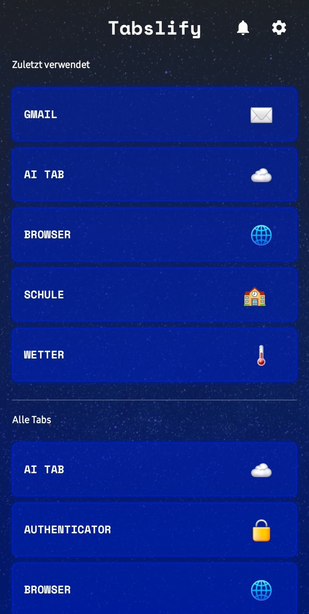
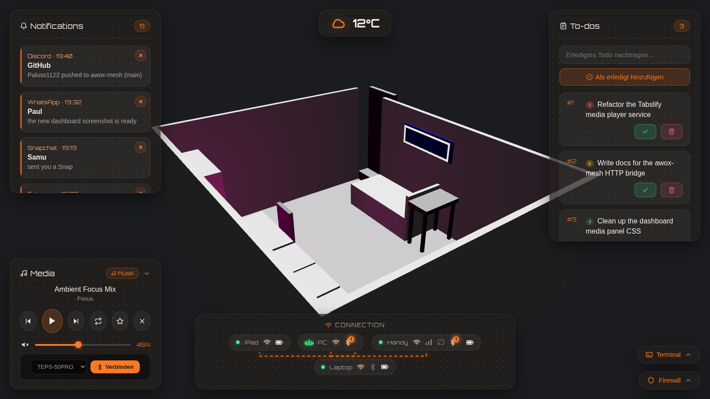

# Paul (paluss1122)

I'm 14 and I program. Most of what I build comes from wanting something that should exist already, so I write it myself.

My main project is **Tabslify**, an Android app that puts a media player, podcast and music downloader, 2FA authenticator, notes, browser and AI chat in one place. It's written in Kotlin with Jetpack Compose and is in beta.

  

I also run my own home server. It's a Python service that controls my lights over Bluetooth, keeps files in sync across my devices and provides a web dashboard and API for all of it.

  

I got into programming with C# and Unity, built a few Roblox games with friends, and later moved to Kotlin, Python and web development.

Main tools: Kotlin, Jetpack Compose, Python, JavaScript, HTML/CSS, Supabase.

## Projects

- **Tabslify** - Android app (Kotlin): https://github.com/Paluss1122-1/Tabslify
- **awox-mesh** - BLE control for AwoX/EGLO lamps (Python): https://github.com/Paluss1122-1/awox-mesh
- **Games** - browser games (JavaScript): https://github.com/Paluss1122-1/Games

Portfolio: https://paluss1122.netlify.app/
Email: paluss1122@gmail.com
